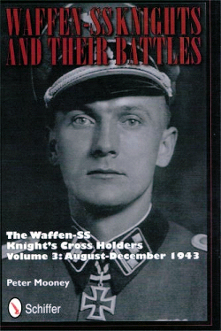
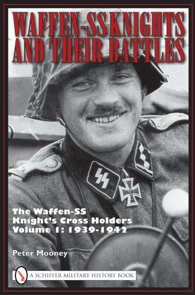
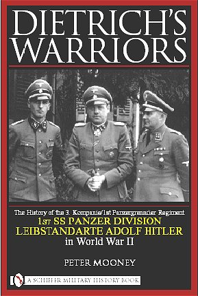

<h3>Waffen-SS Knights and their Battles Volume 3: August - December 1943</h3>

This third volume in the on-going series continues the overview of each Waffen-SS unit that fought in World War II, and follows each unit as it was formed and where it fought. Within each of the battles covered, the book focuses specifically on Waffen-SS soldiers awarded the various grades of the Knight's Cross. This book covers the period August to December 1943 and details actions in the chaotic post-Kursk period on the Eastern Front, as well as the opening of the second front in Italy. Unlike previous Knight's Cross books that are reference based works, these books are aimed at providing a detailed account of the part played by each Waffen-SS Knight's Cross holder in each battle. This project was written to answer the questions: How many Knight's Cross holders received their award for the same battle or action? Were they one mile or a thousand miles apart? Did the actions take place on the same day? These books provide the answers. This book also includes a foreword by Kurt Sametreiter, awarded the Knight's Cross while serving with the 1st SS Panzer Division Leibstandarte Adolf Hitler.

Price &pound;27.50 (postage extra) (UK postage &pound;6.00 as of end of 2012, as a guide)

<h3>Waffen-SS Knights and their Battles - Volume 2: January-July 1943</h3>

Volume 2 covers from January until the end of July 1943, covering the critical battles of Kharkov and Kursk (amongst others). It continues the coverage of the Waffen-SS Knight's Cross and Oakleaves awardees, plus the first of the Swords holders. This project has been compiled with the assistance of surviving Waffen-SS Knight's Cross holders and the soldiers that fought alongside them. This volume contains a Foreword by Eberhard Heder, awarded his Knight's Cross whilst serving with the 5th SS-Panzer Division Wiking.

This book is available for &pound;27.50; postage and packaging are additional and can be confirmed at the time of order. The book can be signed personally to you, with an inscription of your choice.

<h3>Waffen-SS Knights and their Battles - Volume 1: 1939-1942</h3>

This multi-volume project provides an overview of each Waffen-SS unit that was raised, where it was formed and also each battle it fought in. Within each of these battles, this book specifically focuses on each Waffen-SS soldier that was awarded the Knight's Cross and Oakleaves.

This first volume briefly covers the pre-war years, then focuses on the 1939-1942 war years. Poland, the West, the Balkans and Russia are all detailed, as the Waffen-SS began to add Knight's Cross holders to the ranks. This project has been compiled with the assistance of surviving Waffen-SS Knight's Cross holders and the soldiers that fought alongside them.

Unlike previous Knight's Cross books that are reference based, this project is aimed at providing a detailed account of the part played by each Waffen-SS Knight's Cross holder in each battle during World War Two. This project was written to provide answers to the questions: How many Waffen-SS Knight's Cross holders received their award for the same battle or action? Where they 1 mile, or 1000 miles apart? Did their actions take place on the same day? This multi-volume project will provide those answers. This volume contains a Foreword by Karl Nicolussi-Leck, awarded his Knight's Cross whilst serving with the 5th SS-Panzer Division Wiking.

This book is available for &pound;27.50; postage and packaging are additional and can be confirmed at the time of order. The book can be signed personally to you, with an inscription of your choice.

<h3>Dietrich's Warriors - The History of the 3. Kompanie LSSAH</h3>

The 3. Kompanie of the 1st SS-Panzergrenadier Regiment, 1st SS-Panzer Division Leibstandarte "Adolf Hitler" (the unit that the Second Battle Group portray) were formed in the summer of 1933. This book briefly covers their pre-war activities as part of Hitler's showpiece protection squad. The main focus of this book is upon the 3. Kompanie's military actions between 1939-1945 and details the various battles that they took part in, which covered nearly every major campaign of the German armed forces at that time.

This work has been compiled with the help of former soldiers of the 3. Kompanie and the 1st SS-Panzer Division, backed up various other sources. It contains 12 original maps and 75 photographs, 35 of these are previously unpublished. In addition to to detailing the 3. Kompanie's actions between 1933-1945, this book also contains biographies on the various Kompanie, Battalion and Regimental Commanders that the 3.Kompanie were led by, where information is available. This book will provide the reader, whether new to this subject or not, with an additional detailed insight into one of history's finest fighting units.

This book is available for &pound;25.00; postage and packaging are additional and can be confirmed at the time of order. The book can be signed personally to you, with an inscription of your choice.

