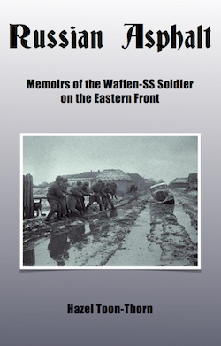

<h3>Russian Asphalt: Memoirs of the Waffen-SS Soldier on the Eastern Front</h3>

This new title, written by Hazel Toon-Thorn (wife of LSSAH Panzer IV driver, Manfred Thorn), who has compiled a series of recollections from former soldiers of the Waffen-SS.

These recollections cover all aspects of the fighting against the Soviets between 1941 and 1945, from the heady days of advance into Russia, right up to fighting near Berlin. The book features lots of interview excerpts and is placed within an overall framework of what was unfolding during those years.

A great insight into the personal experiences of the 'soldier on the ground' during this titanic military struggle. This book contains a Foreword by former SS-Obersturmfuhrer Paul Rosch, who served with the 5th and 16th SS Divisions.

Soft cover, A5 format, 236 pages, 70 photographs and 6 maps.  Price: &pound;17.00 (postage extra)

Please email with your order to <a href="mailto:contactus@lahpublishing.com">contactus@lahpublishing.com</a>

